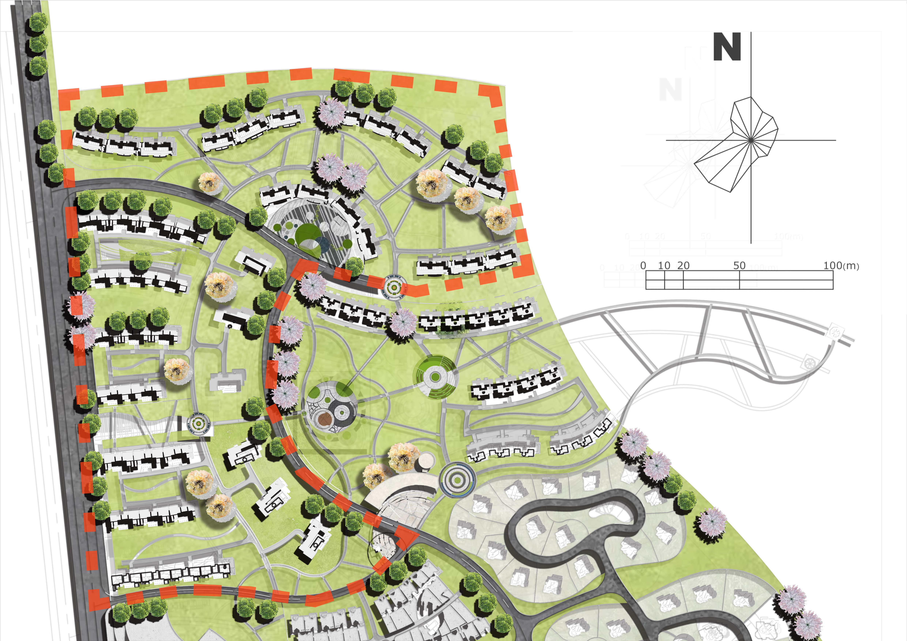
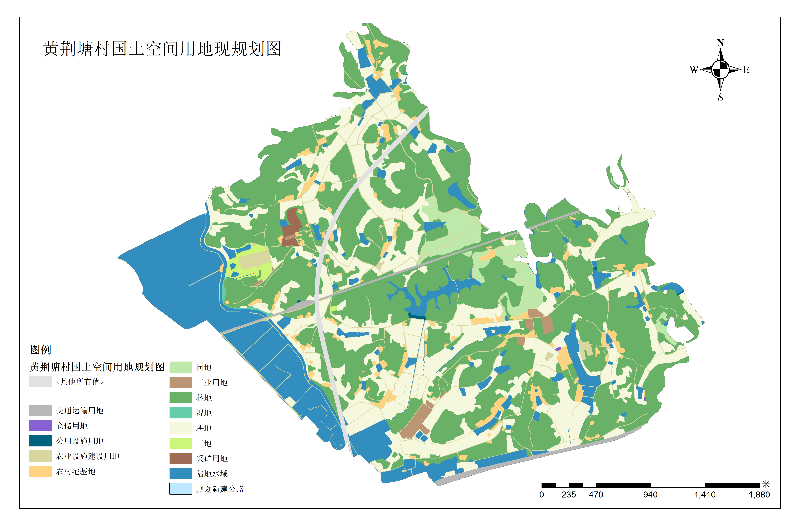

# 李慧琳｜城乡规划作品集

## About Me

武汉华夏理工学院城乡规划专业本科生。

熟练掌握 ArcGIS、AutoCAD、Photoshop、SketchUp、CityPlan 等专业软件，具备城乡规划设计、空间数据分析与规划表达能力。

在校期间参与城市设计、居住区规划、乡村规划、公共空间设计及 GIS 空间分析等多个项目，能够独立完成前期调研、数据分析、方案设计与成果表达全过程工作。

---

# Portfolio

## 01 产城融合片区城市更新设计

以武汉洪山白沙滨江融合产城片区为研究对象，探索滨江空间更新、商业活力塑造与居住品质提升的协同发展模式。

---

## 02 居住区规划设计

围绕生态宜居社区建设，完成用地布局、道路系统、景观空间及住宅组团设计。

---

## 03 高铁站片区设计

以交通枢纽为核心，构建集交通换乘、商业服务与城市门户形象于一体的综合功能片区。

---

## 04 公园景观设计

结合场地特征与生态资源，打造开放共享的城市公共活动空间。

---

## 05 黄荆塘村分析研究

通过空间分析与现状调研，对村庄资源、人口结构及发展潜力进行系统研究。

---

## 06 湖北省人口与核密度分析

基于 ArcGIS 开展人口空间分布及核密度分析，探索区域发展格局与空间结构特征。

---

## 07 社区设计

聚焦社区公共空间营造与居民活动需求，构建宜居共享的社区环境。

---

# Skills

* ArcGIS
* AutoCAD
* Photoshop
* SketchUp
* CityPlan
* PowerPoint
* Excel

---

# Contact

Email：[3212955799@qq.com](mailto:3212955799@qq.com)
